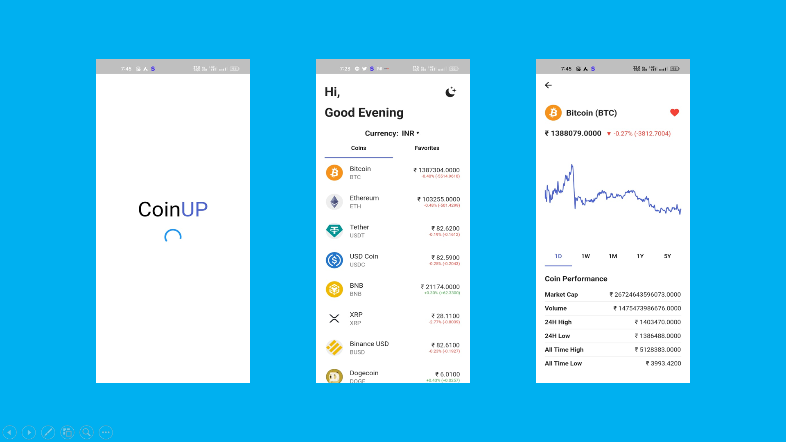
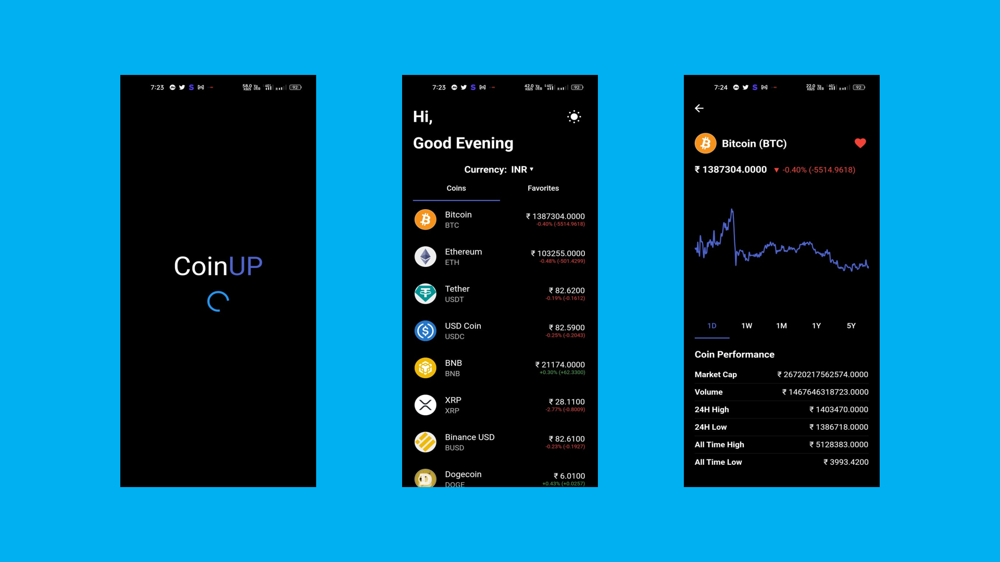
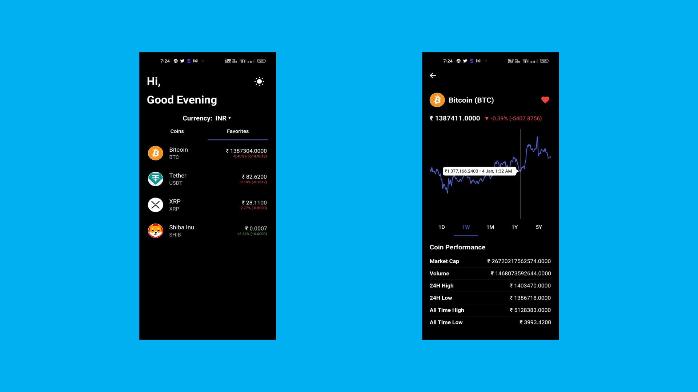

# CoinUP

A Crypto currency tracker app using provider.

## Features and Interfaces

1. Home page
   - Shows the top 100 crypto coins depending on its market cap.
   - The user can also see the favourite section for the coins which have been selected as favourite. 
   - User can change the default currency from the drop down button.
   - Theme switch button in the top right corner.

    Light Theme:-
   
    
   
    Dark Theme:-
    
    

2. Details Page
   - The user can see all the details about the coin and make it favourite.
   - The user can also view the coins price graph over time.

    

## Technology Used

- Flutter
- Provider

